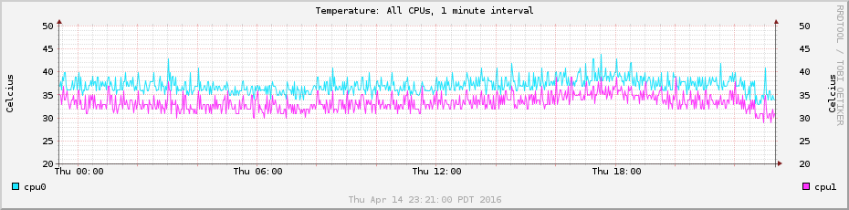
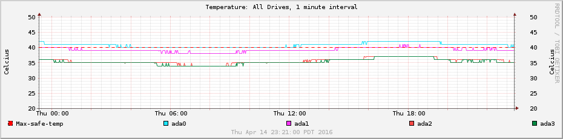
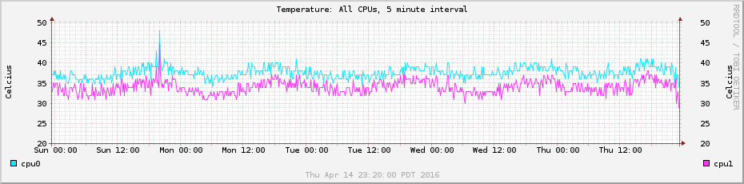
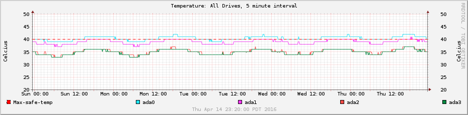

freenas-temperature-graphing
============================

Bash scripts to graph FreeNAS CPU and drive temperatures. Graphs are generated
in the same directory as the scripts (not the web interface). Tested on 9.3,
9.10, and 11.2.

 

Example output:
---------------

 

Installation:
-------------

1.  Copy the .sh files to a share on your server. Take note of the full path to
    the files (ex. `/mnt/mainpool/myshare/temperature-monitoring/rrd.sh`)

2.  Schedule the scripts to run regularly. The recommended method is via the
    FreeNAS Tasks panel in the web interface, since any cronjobs in crontabs are
    wiped out during upgrades. You need one task for data collection, and
    another task for data graphing:

    1.  Create a new task (see [tasks screenshot](examples/tasks.png))

    2.  Set the user to `root` (SMART data access requires super-user privs).
        See [screenshot 1](examples/task1.png).

    3.  Enter the path to the script run, followed by the path to the data file
        (the rrd.sh script will create it if it doesn't exist yet). See
        [screenshot 1](examples/task1.png). For example, if you want
        temperatures to be collected every 5 minutes you would create two tasks:

        1.  The data collection task would have the "Command" field set to:
            `/mnt/mainpool/misc/temperature-monitoring/rrd.sh
            /mnt/mainpool/misc/temperature-monitoring/temps-5min.rrd`

        2.  The graphing task would have the "Command" field set to:
            `/mnt/mainpool/misc/temperature-monitoring/rrd-graph.sh
            /mnt/mainpool/misc/temperature-monitoring/temps-5min.rrd`

        3.  NOTE: The time part of the name (5min) is important, since the
            scripts use it to know how to format the data. It has to be a number
            followed by "min".

    4.  Enter the time between runs: minutes (**5**), hours (**1**), and days
        (**1**). Set it to run every month and day of the week. See [screenshot
        1](examples/task1.png) and [screenshot 2](examples/task2.png)

    5.  Redirect `Stdout` (otherwise you'll get emails every time the graphs
        are generated). Make sure the task is `enabled`. See [screenshot
        3](examples/task3.png)

    6.  After about 5 intervals, you should have enough data that the graphs
        will start contain visible data. The graphs will appear as png files in
        the same directory as the scripts (regardless of where the rrd files are
        stored).

 

Extras:
-------

The rrd-graph.sh script contains code to graph each device individually as well
as all together. Just uncomment the function call at the bottom of `rrd-graph.sh`.

The colors can be adjusted at the top of the `rrd-graph.sh` file.

The temperature lines can be changed in the `rrd-graph.sh` file, or by setting enivronment variables when running:
Example: `MAXGRAPHTEMP=55 /pathto/rrd-graph.sh /pathto/temps-5min.rrd`
Temperature variables are:
`MAXGRAPHTEMP`
`MINGRAPHTEMP`
`SAFETEMPMAX`
`SAFETEMPMIN`

Troubleshooting:
----------------

- Try running the script manually with the verbose flag (-v). Example: `/mnt/mainpool/misc/temperature-monitoring/rrd-graph.sh -v /mnt/mainpool/misc/temperature-monitoring/temps-5min.rrd`

- Errors and possible causes:
    
    - `"ERROR: mmaping file '/mnt/mainpool/misc/temperature-monitoring/temps-60min.rrd': Invalid argument"`
        
        - This probably means that the rrd file wasn't initialized properly. Try deleting it and running the script again (it should initialize a new one if it's missing)

    - `ERROR: opening '/mnt/mainpool/misc/temperature-monitoring/temps-60min.rrd': No such file or directory`
        
        - This may happen on the first run, if the graphing script runs before the temperature-gathering script runs. It should only happen once.

Pull requests welcome
